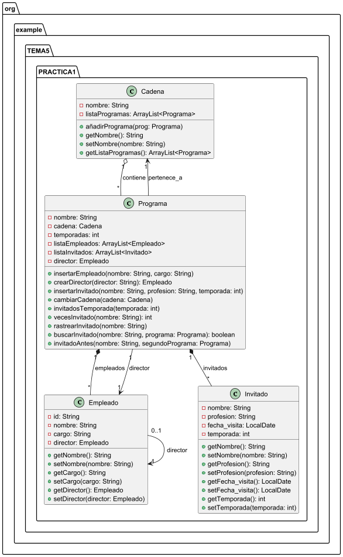

# Práctica 1. Práctica del Formiguero y La Rebelión


## ÍNDICE 
1. [Intro](#1-intro)
2. [Estructura de clases](#2-estructura-de-clases)
3. [Programa principal](#3-programa-principal)
4. [Pruebas](#4-pruebas)
5. [Entrega](#5-entrega)

### 1. Intro
> En esta práctica deberemos de realizar varias clases para poder usar una App (AppProgramas) en la que gestionaremos cadenas, programas, empleados, invitados…
Cada uno de los mencionados anteriormente es una clase:
•	Cadena es la cadena de televisión que contiene programas
•	Programa es la clase donde creas objetos Programa, cada programa pertenece a una cadena, y en el futuro, puede cambiar de cadena. Cada programa tiene sus invitados y empleados, estos son dependientes del programa, por lo que, si el programa desaparece, los otros también lo harán. Empleado e invitado se crean dentro de la clase Programa a partir de unos métodos.
•	Empleado es una clase usada para crear un empleado de un programa, tiene una ID generada por un método, nombre, cargo (que debe ser un cargo contemplado o pte) y director, que será siempre el director del programa al que pertenece.
•	Invitado es una clase que corresponde al invitado de un programa, un invitado tiene nombre, profesión, fecha de visita (que se asignará mediante un método), y temporada en la que aparece.


### 2. Estructura de clases
#### Diagrama de clases UML

#### Código de PlantUML

````@startuml
package org.example.TEMA5.PRACTICA1 {

    class Cadena {
        - nombre: String
        - listaProgramas: ArrayList<Programa>
        + añadirPrograma(prog: Programa)
        + getNombre(): String
        + setNombre(nombre: String)
        + getListaProgramas(): ArrayList<Programa>
    }

    class Programa {
        - nombre: String
        - cadena: Cadena
        - temporadas: int
        - listaEmpleados: ArrayList<Empleado>
        - listaInvitados: ArrayList<Invitado>
        - director: Empleado
        + insertarEmpleado(nombre: String, cargo: String)
        + crearDirector(director: String): Empleado
        + insertarInvitado(nombre: String, profesion: String, temporada: int)
        + cambiarCadena(cadena: Cadena)
        + invitadosTemporada(temporada: int)
        + vecesInvitado(nombre: String): int
        + rastrearInvitado(nombre: String)
        + buscarInvitado(nombre: String, programa: Programa): boolean
        + invitadoAntes(nombre: String, segundoPrograma: Programa)
    }

    class Empleado {
        - id: String
        - nombre: String
        - cargo: String
        - director: Empleado
        + getNombre(): String
        + setNombre(nombre: String)
        + getCargo(): String
        + setCargo(cargo: String)
        + getDirector(): Empleado
        + setDirector(director: Empleado)
    }

    class Invitado {
        - nombre: String
        - profesion: String
        - fecha_visita: LocalDate
        - temporada: int
        + getNombre(): String
        + setNombre(nombre: String)
        + getProfesion(): String
        + setProfesion(profesion: String)
        + getFecha_visita(): LocalDate
        + setFecha_visita(): LocalDate
        + getTemporada(): int
        + setTemporada(temporada: int)
    }

    ' Relaciones

    ' Cadena ↔ Programa (asociación bidireccional)
    Cadena "1" o-- "*" Programa : contiene
    Programa --> "1" Cadena : pertenece_a

    ' Programa → Empleado / Invitado (composición)
    Programa "1" *-- "*" Empleado : empleados
    Programa "1" *-- "*" Invitado : invitados

    ' Programa → director (Empleado)
    Programa "1" --> "1" Empleado : director

    ' Empleado → director (si no es director)
    Empleado "0..1" --> "1" Empleado : director
}

@enduml
````


#### Contenido de las clases (java)

  - Clase **Cadena.java**
> [Link al archivo](https://github.com/daidarzzz/Repositorio1DAM/blob/75364e5263c0f6cfb921269f7932471facedaa81/ejercicios_DAM/src/main/java/org/example/TEMA5/PRACTICA1/Cadena.java)

````
package org.example.TEMA5.PRACTICA1;

import java.util.ArrayList;

public class Cadena {

    //Variables de la clase
    private String nombre;
    private ArrayList<Programa> listaProgramas; //Creamos un arraylist llamado listaProgramas, contiene todos los programas de la cadena

    //Constructor -> recibe el nombre
    public Cadena (String nombre) {
        //Asignamos el nombre
        this.nombre = nombre;
        //La lista de programas se inicializa
        listaProgramas = new ArrayList<>();

    }

    //Método para añadir programas (recibe el programa como parámetro)
    public void añadirPrograma(Programa programa) {
        //Añade el programa si no estaba ya
        if(!listaProgramas.contains(programa)) {
            listaProgramas.add(programa);
            programa.setCadena(this);
        } else {
            System.out.println("El programa " + programa + " ya pertenece a la cadena.");
        }

    }

    public String getNombre() {
        return nombre;
    }

    public void setNombre(String nombre) {
        this.nombre = nombre;
    }

    public ArrayList<Programa> getListaProgramas() {
        return listaProgramas;
    }

    //No hay setListaProgramas, para esto tenemos un método.

    //ToString sin cambios.
    @Override
    public String toString() {
        return "Cadena{" +
                "nombre='" + nombre + '\'' +
                ", listaProgramas=" + listaProgramas +
                '}';
    }
}

````

  - Clase **Programa.java**
> [Link al archivo](https://github.com/daidarzzz/Repositorio1DAM/blob/75364e5263c0f6cfb921269f7932471facedaa81/ejercicios_DAM/src/main/java/org/example/TEMA5/PRACTICA1/Programa.java)

````
package org.example.TEMA5.PRACTICA1;

import java.time.LocalDate;
import java.util.ArrayList;
import java.util.Arrays;

//Creamos la clase programa
public class Programa {

    //Creamos sus atributos como privados
    private String nombre;
    private Cadena cadena;
    private int temporadas;
    //Estos dos arraylist deberán de ser inicializados después, en el constructor
    private ArrayList<Empleado> listaEmpleados;
    private ArrayList<Invitado> listaInvitados;
    private Empleado director; //Metemos un objeto "Empleado" como atributo


    //Constructor -> Recibe el nombre, la cadena a la que pertenecerá y el director (Que se crea automáticamente)
    public Programa(String nombre, Cadena cadena, String director) {

        //Asignamos los valores a las variables correspondientes
        this.nombre = nombre;
        this.cadena = cadena;
        temporadas = 0; //El programa siempre empezará teniendo 0 temporadas
        //Inicialziamos los ArrayList
        listaEmpleados = new ArrayList<>();
        listaInvitados = new ArrayList<>();
        this.director = crearDirector(director); //Para crear un director, usaremos una función

        cadena.añadirPrograma(this); //Añadimos a la cadena que nos han pasado, nuestro programa. (Llamada a la función añadir programa)

    }


    //Método insertarEmpleado, con esto crearemos un empleado a partir de los parámetros nombre y cargo.
    public void insertarEmpleado(String nombre, String cargo) {
            //Creamos un nuevo empleado con los parámetros asignados, y le asignamos como director el director que tiene el programa.
            Empleado empleado = new Empleado(nombre, cargo.toLowerCase(), this.getDirector());

            listaEmpleados.add(empleado); //Lo añadimos a la lista de empleados


    }

    //Método para crear un director, devuelve el director creado.
    public Empleado crearDirector(String director) {
        //Creamos un director con los parámetros que recibimos, y ponemos por defecto que el director es null (porque el no tiene ningún director delante suya)
        Empleado direc = new Empleado(director, "director", null);
        listaEmpleados.add(direc); //Añadimos el director a la lista de empleados
        return direc; //Devovemos el director creado

    }

    //Método que se encarga de crear un invitado para el programa correspondiente, recibe el nombre, la profesión y la temporada en la que aparece
    public void insertarInvitado(String nombre, String profesion, int temporada) {
        //Creamos al invitado con los parámetros recibidos.

        Invitado invitado = new Invitado(nombre, profesion, temporada);

        listaInvitados.add(invitado); //Lo añadimos a la lista de invitados

        //En caso de que la temporada en la que salga sea mayor que "temporadas", significa de que hay nuevas temporadas, por lo que actualizamos la variable.
        if (temporada > this.temporadas) this.temporadas = temporada;

    }


    //método que sirve para que un programa cambie de cadena
    public void cambiarCadena(Cadena cadena) {

        //Borramos nuestro programa de la cadena anterior
        this.cadena.getListaProgramas().remove(this);

        //Le asignamos a nuestro programa su nueva cadena
        this.cadena = cadena;

        //Ahora añadimos a la lista de programas de la nueva cadena, el programa actual
        cadena.getListaProgramas().add(this);


    }

    //Método que te muestra cuantos invitados hubo en una temporada del programa, recibe la temporada
    public void invitadosTemporada(int temporada) {
        //Inicializamos un contador de cuantos invitados hubo
        int contadorInvitados = 0;
        //Creamos una lista de invitados, debido a que, quiero que solo cuente para el contador invitados DISTINTOS, no quiero que una persona aparezca dos veces.
        ArrayList<String> invitados = new ArrayList<>();

        System.out.println("INVITADOS EN LA TEMPORADA " + temporada + ":");
        //Bucle que recorre toda la lista de invitados
        for (int i = 0; i < listaInvitados.size(); i++) {

            //Creamos un invitado actual
            Invitado invitadoActual = listaInvitados.get(i);

            //En caso de que la temporada en la que sale el invitado actual coincida con la temporada solicitada Y el invitado no esté en la lista de invitados aún . . .
            if (invitadoActual.getTemporada() == temporada && !invitados.contains(invitadoActual.getNombre())) {
                contadorInvitados++; //se suma el contador
                //Mostramos al invitado
                System.out.println("[" + contadorInvitados + "] - " + invitadoActual.getNombre() + " (" + invitadoActual.getProfesion() + ")");
                //Lo añadimos a la lista provisional.
                invitados.add(invitadoActual.getNombre());
            }

        }

    }

    //Método que te devuelve las veces que el invitado ha acudido al programa.
    public int vecesInvitado(String invitado) {


        int contadorVecesInvitado = 0;

        //recorremos la lista de invitados
        for (int i = 0; i < listaInvitados.size(); i++) {

            //Si el nombre del invitado actual (en la lista) coincide con el invitado que buscamos ...
            if (listaInvitados.get(i).getNombre().equalsIgnoreCase((invitado.toLowerCase()))) {
                contadorVecesInvitado++; //Se sumará el contador en uno
            }


        }

        return contadorVecesInvitado; //Devolvemos el contador

    }


    //Método que te muestra cada vez que un invitado ha acudido, hacemos uso del método anterior.
    public void rastrearInvitado(String nombre) {

        //Contador que solo sirve para hacerlo más bonito el print
        int contador = 0;
        int vecesInvitado = vecesInvitado(nombre); //Llamamos al método anterior para saber cuántas veces ha acudido al programa
        System.out.println("El invitado " + nombre + " ha acudido " + vecesInvitado + " veces al programa:");

        //Bucle que recorre toda la lista de invitados
        for (int i = 0; i < listaInvitados.size(); i++) {
            //Si el nombre del invitado actual [listaInvitados.get(i)] es el mismo que el nombre que recibimos como parámetro
            if (listaInvitados.get(i).getNombre().equalsIgnoreCase(nombre)) {
                //Creamos la variable invitado (que es el invitado actual)
                Invitado invitado = listaInvitados.get(i);
                contador++;//Aumentamos el contador en uno
                //Mostramos la aparición del invitado, con la temporada y la fecha
                System.out.println("["+  contador + "] " + " Temporada: " + invitado.getTemporada() + ", Fecha: " + invitado.getFecha_visita());

            }

        }

    }


    //Método buscar invitado, devuelve true si el invitado ha acudido al programa correspondiente.
    public boolean buscarInvitado(String nombre, Programa programa) {


        //Recorremos la lista de invitados del programa que hemos introducido como parámetro
        for (int i = 0; i < programa.listaInvitados.size(); i++) {

            //En el momento en que el invitado que buscamos salga en la lista de invitados de ese programa . . .
            if (programa.listaInvitados.get(i).getNombre().equalsIgnoreCase(nombre)) {

                return true; //Nos devuelve true, indicando que si que ha salido en el programa

            }

        }

        return false; //Si terminamos todo el bucle, significa que nunca participó en el programa, devolviendo false

    }


    //Método que comprueba a qué programa fue antes un invitado, recibe el programa con el que quiere comparar como parámetro
    public void invitadoAntes(String nombre, Programa segundoPrograma) {

        //Si el invitado nunca ha estado en este programa, se acaba el método, avisandote de ello
        if (!buscarInvitado(nombre, this)) {
            System.out.println(nombre + " nunca ha participado en el programa " + this.nombre);
            return;
        }

        //Si el invitado nunca ha estado en el segundo programa, se acaba el método, avisandote de ello
        if (!buscarInvitado(nombre, segundoPrograma)) {
            System.out.println(nombre + " nunca ha participado en el programa " + segundoPrograma.getNombre());
            return;
        }

        //Inicializamos dos LocalDate como null, luego le asignaremos su valor
        LocalDate fechaPrimerPrograma = null;
        LocalDate fechaSegundoPrograma = null;


        //Recorremos la lista de invitados del programa actual
        for (int i = 0; i < this.listaInvitados.size(); i++) {

            //Creamos la variable invitadoActual
            Invitado invitadoActual = this.listaInvitados.get(i);

            //Si el nombre del invitado actual (el de la lista de invitados) coincide con el nombre del invitado que buscamos  . . .
            if (invitadoActual.getNombre().equalsIgnoreCase(nombre)) {

                //Si fecha es null O la fecha del invitadoActual va antes de fechaPrimerPrograma...
                if ( fechaPrimerPrograma == null || invitadoActual.getFecha_visita().isBefore(fechaPrimerPrograma)) {
                    fechaPrimerPrograma = invitadoActual.getFecha_visita(); //fechaPrimerPrograma ahora tendrá de valor la fecha del invitadoActual
                    //Con esto, evitamos el error de NullPointer y saldremos del bucle con la fecha más pequeña (la primera vez que fue al programa)
                }
            }

        }

        //realizamos el mismo proceso, pero esta vez para el segundo programa, y la fecha se asignará a fechaSegundoPrograma.
        for (int i = 0; i < segundoPrograma.listaInvitados.size(); i++) {

            Invitado invitadoActual = segundoPrograma.listaInvitados.get(i);

            if (invitadoActual.getNombre().equalsIgnoreCase(nombre)) {
                if (fechaSegundoPrograma == null || invitadoActual.getFecha_visita().isBefore(fechaSegundoPrograma)) {
                    fechaSegundoPrograma = invitadoActual.getFecha_visita();
                }
            }

        }

        //Mostramos la fecha que fue primera
        //Fecha 1 fue antes
        if (fechaPrimerPrograma.isBefore(fechaSegundoPrograma)) System.out.println(nombre + " fue primero a " + this.nombre + " (" + fechaPrimerPrograma + ") que a " + segundoPrograma.getNombre() + " (" + fechaSegundoPrograma + ")");
        //Fecha 2 fue antes
        else if (fechaPrimerPrograma.isAfter(fechaSegundoPrograma)) System.out.println(nombre + " fue primero a " + segundoPrograma.getNombre() + " (" + fechaSegundoPrograma + ") que a " + this.nombre + " (" + fechaPrimerPrograma + ")");
        //Ambas fechas coinciden
        else System.out.println("Fue el mismo día a ambos programas (" +fechaPrimerPrograma + ")");

    }


    //GETTERS Y SETTERS . . .
    public String getNombre() {
        return nombre;
    }

    public void setNombre(String nombre) {
        this.nombre = nombre;
    }

    public Cadena getCadena() {
        return cadena;
    }

    public void setCadena(Cadena cadena) {
        this.cadena = cadena;
    }

    public int getTemporadas() {
        return temporadas;
    }


    //Considero que SI puedes asignar el número de temporadas desde el set.
    public void setTemporadas(int temporadas) {
        this.temporadas = temporadas;
    }

    public ArrayList<Empleado> getListaEmpleados() {
        return listaEmpleados;
    }

    //No hay set listaempleados, tenemos un método dedicado a ello.

    public ArrayList<Invitado> getListaInvitados() {
        return listaInvitados;
    }


    //Tampoco tenemos set listainvitados por la misma razón

    public Empleado getDirector() {
        return director;
    }

    //No hay set director, se asigna solo, siempre.


    //ToString básico, a director le ponemos .getNombre

    @Override
    public String toString() {
        return "Programa{" +
                "nombre='" + nombre + '\'' +
                ", cadena=" + cadena.getNombre() +
                ", temporadas=" + temporadas +
                ", listaEmpleados=" + listaEmpleados +
                ", listaInvitados=" + listaInvitados +
                ", director=" + director.getNombre() +
                '}';
    }
}
````
  - Clase **Empleado.java**
> [Link al archivo](https://github.com/daidarzzz/Repositorio1DAM/blob/75364e5263c0f6cfb921269f7932471facedaa81/ejercicios_DAM/src/main/java/org/example/TEMA5/PRACTICA1/Empleado.java)

````
package org.example.TEMA5.PRACTICA1;

import java.lang.reflect.Array;
import java.util.Arrays;

public class Empleado {

    //Array que contiene todos los cargos que puedes tener
    static String[] cargosDisponibles = {"director", "tecnico", "presentador", "colaborador"};
    static int numEmpleados = 0; //Contador global que indica el número de empleados (se usará para calcular la ID)

    //Variables de la clase
    private String id;
    private String nombre;
    private String cargo;
    private Empleado director;

    //Constructor -> Incluye todo menos la ID
    public Empleado(String nombre, String cargo, Empleado director) {

        id = generarID(); //Para generar la ID llamamos al método generarID
        //Asignamos a las variables de la clase los parámetros introducidos.
        this.nombre = nombre;
        this.cargo = validarCargo(cargo); //Llamada al método validarCargo para asignarlo correctamente
        this.director = director;

    }

    //Constructor 2 -> Lo mismo pero no le asignamos director
    public Empleado(String nombre, String cargo) {

        this(nombre, cargo, null);

    }


    //Método que genera una ID -> Pone EP y seguidamente pone el número de empleado que le corresponde. Devuelve la ID
    public String generarID() {

        return "EP" + (++numEmpleados);

    }


    //Método que devuelve un String (el cargo)
    public String validarCargo(String cargo) {

        //En caso de que el cargo que hayas introducido esté contemplado
        if (Arrays.asList(cargosDisponibles).contains(cargo.toLowerCase())) {

            return cargo.toLowerCase(); //Te devolverá el cargo, por lo que el cargo está bien

        } else {
            return "pte"; //Si no está contemplado, te pondrá el cargo por defecto (pte)
        }

    }

    public String getId() {
        return id;
    }

    //No podemos cambiar la id (no hay setID)

    public String getNombre() {
        return nombre;
    }

    public void setNombre(String nombre) {
        this.nombre = nombre;
    }

    public String getCargo() {
        return cargo;
    }

    //En el setCargo llamamos a la función de validarCargo para cambiar correctamente
    public void setCargo(String cargo) {
        this.cargo = validarCargo(cargo);
    }

    public Empleado getDirector() {
        return director;
    }

    //No hay set director, este se pone automáticamente.


    //ToString básico
    @Override
    public String toString() {
        return "Empleado{" +
                "id='" + id + '\'' +
                ", nombre='" + nombre + '\'' +
                ", cargo='" + cargo + '\'' +
                ", director=" + director +
                '}';
    }
}
````
  - Clase **Invitado.java**
> [Link al archivo](https://github.com/daidarzzz/Repositorio1DAM/blob/75364e5263c0f6cfb921269f7932471facedaa81/ejercicios_DAM/src/main/java/org/example/TEMA5/PRACTICA1/Invitado.java)

````
package org.example.TEMA5.PRACTICA1;

import java.time.LocalDate;
import java.time.LocalDateTime;
import java.time.LocalTime;
import java.util.InputMismatchException;
import java.util.Scanner;

public class Invitado {

    private static Scanner read = new Scanner(System.in);


    //Variables de la clase Invitado
    private String nombre;
    private String profesion;
    private LocalDate fecha_visita; //LocalDate almacena una fecha
    private int temporada;


    //Constructor -> Recibe todo menos la fecha de visita.
    public Invitado (String nombre, String profesion, int temporada) {

        //Asignamos los parámetros como valor de las variables
        this.nombre = nombre;
        this.profesion = profesion;
        this.temporada = temporada;
        fecha_visita = setFecha_visita(); //Llamamos al setFecha_visita para que nos devuelva la fecha

    }


    //GETTER Y SETTERS
    public String getNombre() {
        return nombre;
    }

    public void setNombre(String nombre) {
        this.nombre = nombre;
    }

    public String getProfesion() {
        return profesion;
    }
    public void setProfesion(String profesion) {
        this.profesion = profesion;
    }

    public LocalDate getFecha_visita() {
        return fecha_visita;
    }

    //Aquí aplicamos la lógica para asignar una fecha
    public LocalDate setFecha_visita() {

        //inicializamos las variables para dia mes y año
        int dia = 0;
        int mes = 0;
        int anyo = 0;

        //Pedimos los valores llamando a un método pedirEntero
        anyo = pedirEntero("Introduce el año en el que acudirá el invitado " + this.nombre + ": ");
        mes = pedirEntero("Introduce el mes: ");
        dia = pedirEntero("Introduce el dia: ");

        //Asignamos los valores a "fecha"
        LocalDate fecha = LocalDate.of(anyo, mes, dia);

        return fecha; //Devolvemos la fecha

    }


    //Método que comprueba que el entero introducido es válido (Sacado del tema 4 -> Prefabs)
    public static int pedirEntero(String texto) {
        int num = 0;
        boolean seguir = true;

        do {
            System.out.print(texto);
            try {
                num = read.nextInt();
                read.nextLine();
                seguir = false;
            } catch (InputMismatchException e) {
                System.out.println("Error. Debes introducir un número entero");
                read.nextLine();
            }
        } while (seguir);

        return num;
    }

    public int getTemporada() {
        return temporada;
    }

    public void setTemporada(int temporada) {
        this.temporada = temporada;
    }


    //ToString básico
    @Override
    public String toString() {
        return "Invitado{" +
                "nombre='" + nombre + '\'' +
                ", profesion='" + profesion + '\'' +
                ", fecha_visita=" + fecha_visita +
                ", temporada=" + temporada +
                '}';
    }
}
````

### 3. Programa Principal
  - Clase **AppProgramas.java**
> [Link al archivo](https://github.com/daidarzzz/Repositorio1DAM/blob/75364e5263c0f6cfb921269f7932471facedaa81/ejercicios_DAM/src/main/java/org/example/TEMA5/PRACTICA1/AppProgramas.java)

````
package org.example.TEMA5.PRACTICA1;

import java.sql.SQLOutput;

public class AppProgramas {

    static void main(String[] args) {

        Cadena radioTV = new Cadena("Radio TV");
        Programa pepitoTV = new Programa("Pepito TV", radioTV, "Jacobo SixSeven");
        Programa joaquinTartas = new Programa("JOAQUIN TARTAS", radioTV, "Manuel");
        joaquinTartas.insertarEmpleado("Jorge", "tecnico");
        pepitoTV.insertarEmpleado("Marcos", "Profesor");
        joaquinTartas.insertarInvitado("Pepe", "Pepedor", 3);
        joaquinTartas.insertarInvitado("Pepe", "Pepedor", 4);
        pepitoTV.insertarInvitado("Pepe", "Pepedor", 1);
        pepitoTV.insertarInvitado("Juan", "Papeador", 4);

        System.out.println("CADENA:");
        System.out.println(radioTV);
        System.out.println("PROGRAMA");
        System.out.println(joaquinTartas);
        System.out.println("VECES QUE FUE PEPE A JOAQUINTARTAS: " + joaquinTartas.vecesInvitado("pepe"));

        System.out.println("LISTA DE INVITADOS DE " + joaquinTartas.getNombre());
        System.out.println(joaquinTartas.getListaInvitados());


//        //creamos una cadena de tv
//        Cadena antena3 = new Cadena("Antena 3");
//        System.out.println(antena3);
//
//        //creamos un programa
//        Programa el_hormiguero = new Programa("El Hormiguero",antena3,"Director1");
//        System.out.println(el_hormiguero);
//        System.out.println(antena3);
//
//        //insertamos empleados en el programa
//        el_hormiguero.insertarEmpleado("Pablo Motos","presentador");
//        System.out.println(el_hormiguero);
//
//        //ver empleados del programa
//        System.out.println(el_hormiguero.getListaEmpleados());
//
//        //insertamos invitados en el programa
//        el_hormiguero.insertarInvitado("Aitana","cantante",1);
//
//        //ver invitados del programa
//        System.out.println(el_hormiguero.getListaInvitados());


    }

}
````


### 4. Pruebas


### 5. Entrega
- [X] Código fuente en GitHub: [link](../practica1/)
- [X] Documentación
- [X] Pruebas
