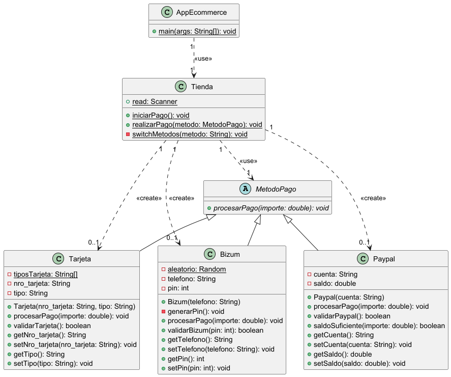

# Práctica 1 - Sistema de Pago para E-commerce

## Índice de contenido
1. [Introducción](#introducción)
4. [Estructura de clases](#estructura-de-clases)
5. [Programa principal](#programa-principal)
6. [Pruebas](#pruebas)
7. [Entrega](#entrega)

---

### 1. Introducción

La práctica nos pide implementar un sistema de pagos para un ecommerce, tendremos 3 métodos de pago: Bizum, PayPal y Tarjeta de Crédito
Los tres métodos de pago extienden de la clase “MetodoPago”, siendo esta la clase madre (y clase abstracta). Estos métodos aplican polimorfismo al método abstracto de la clase madre “procesarPago”.
Con PayPal deberemos de validar que la cuenta tiene los parámetros correctos (chequear que introdujo bien el correo) y debemos de comprobar de que el saldo que tiene la cuenta no es menor al importe del pago que queremos realizar.
Con Bizum, debemos de validar de que el número de teléfono ha sido introducido correctamente (9 números) y comprobar que el usuario introduce el pin correctamente.
Con Tarjeta, la validación debe ser que introduzcas el número de la tarjeta correctamente (16 números) y que hayas seleccionado un tipo de tarjeta que esté contemplado (Visa, Mastercard, Maestro).

Todo el proceso del pago se realizará en la clase “Tienda”, que es donde el usuario elige el método de pago, el importe a pagar, etc.


### 2. Estructura de clases
#### Diagrama de clases UML

#### Código de PlantUML
````
@startuml

' Clase abstracta MetodoPago
abstract class MetodoPago {
    + {abstract} procesarPago(importe: double): void
}

' Clase Tarjeta
class Tarjeta {
    - {static} tiposTarjeta: String[]
    - nro_tarjeta: String
    - tipo: String
    + Tarjeta(nro_tarjeta: String, tipo: String)
    + procesarPago(importe: double): void
    + validarTarjeta(): boolean
    + getNro_tarjeta(): String
    + setNro_tarjeta(nro_tarjeta: String): void
    + getTipo(): String
    + setTipo(tipo: String): void
}

' Clase Paypal
class Paypal {
    - cuenta: String
    - saldo: double
    + Paypal(cuenta: String)
    + procesarPago(importe: double): void
    + validarPaypal(): boolean
    + saldoSuficiente(importe: double): boolean
    + getCuenta(): String
    + setCuenta(cuenta: String): void
    + getSaldo(): double
    + setSaldo(saldo: double): void
}

' Clase Bizum
class Bizum {
    - {static} aleatorio: Random
    - telefono: String
    - pin: int
    + Bizum(telefono: String)
    - generarPin(): void
    + procesarPago(importe: double): void
    + validarBizum(pin: int): boolean
    + getTelefono(): String
    + setTelefono(telefono: String): void
    + getPin(): int
    + setPin(pin: int): void
}

' Clase Tienda
class Tienda {
    + {static} read: Scanner
    + {static} iniciarPago(): void
    + {static} realizarPago(metodo: MetodoPago): void
    - {static} switchMetodos(metodo: String): void
}

' Clase AppEcommerce
class AppEcommerce {
    + {static} main(args: String[]): void
}

' ─── HERENCIA ───
MetodoPago <|-- Tarjeta
MetodoPago <|-- Paypal
MetodoPago <|-- Bizum

' ─── DEPENDENCIA: Tienda crea 0..1 de cada método ───
Tienda "1" ..> "0..1" Tarjeta   : <<create>>
Tienda "1" ..> "0..1" Paypal    : <<create>>
Tienda "1" ..> "0..1" Bizum     : <<create>>

' ─── USO POLIMÓRFICO: realizarPago recibe MetodoPago ───
Tienda "1" ..> "1" MetodoPago   : <<use>>

' ─── AppEcommerce inicia Tienda ───
AppEcommerce "1" ..> "1" Tienda : <<use>>

@enduml
````
#### Contenido de las clases (java)

  - Clase **MetodoPago.java**
> [Link al archivo](https://github.com/daidarzzz/Repositorio1DAM/blob/main/ejercicios_DAM/src/main/java/org/example/TEMA6/Practica1/MetodoPago.java)

````
package org.example.TEMA6.Practica1;


/**
 *
 * @author david
 * @version 1.0
 *
 * Clase abstracta que sirve como "plantilla" para todos los métodos de pago que usaremos (Tarjeta, PayPal, Bizum).
 *
 */
public abstract class MetodoPago {

    public MetodoPago() {

    }


    /**
     * Este método abstracto sirve para procesar un pago con el importe que se indica.
     * Cada hija hereda este método aplicando polimorfismo, cada una hará lo que necesite con el método.
     *
     * @param importe
     */
    public abstract void procesarPago(double importe);

}
````

  - Clase **Tarjeta.java**
> [Link al archivo](https://github.com/daidarzzz/Repositorio1DAM/blob/main/ejercicios_DAM/src/main/java/org/example/TEMA6/Practica1/Tarjeta.java)

````
package org.example.TEMA6.Practica1;

import java.util.Arrays;

/**
 *
 * Esta clase hija de MetodoPago, sirve para realizar pagos mediante "Tarjeta de Crédito".
 * Tiene 3 tipos de tarjeta permitidos: VISA, MASTERCARD, MAESTRO.
 *
 * @author david
 * @version 1.5
 *
 */
public class Tarjeta extends MetodoPago{

    /**
     *
     * Tenemos un array con los tipos de tarjeta válidos
     * También tenemos los dos atributos de la tarjeta (Número de la tarjeta y tipo de tarjeta).
     *
     */
    final String[] tiposTarjeta = {"VISA", "MASTERCARD", "MAESTRO"};

    private String nro_tarjeta;
    private String tipo;


    public Tarjeta(String nro_tarjeta, String tipo) {
        this.nro_tarjeta = nro_tarjeta;
        this.tipo = tipo;
    }


    /**
     *
     * Procesa el pago de la tarjeta de crédito, lo hace mostrando por consola el importe y la tarjeta que ha utilizado.
     * Este método sobreescribe el de la madre.
     * @param importe cantidad a pagar
     */
    @Override
    public void procesarPago(double importe) {
        System.out.println("Procesando pago de " + importe + "€ con tarjeta de crédito " + tipo);
        System.out.println("Pago aceptado, muchas gracias.");
    }

    /**
     *
     * Este método sirve para validar que los datos de la tarjeta sean correctos.
     * Comprueba que el número de la tarjeta sea de 16 dígito y que el tipo de tarjeta
     * esté entre los permitidos. Si cualquiera de las anteriores no se cumple, la tarjeta
     * será inválida.
     * @return devuelve true si la tarjeta es válida, false en caso contrario
     */

    public boolean validarTarjeta() {

        boolean tarjetaValida = true;

        if (nro_tarjeta == null || !nro_tarjeta.matches("\\d{16}")) tarjetaValida = false;
        if (!Arrays.asList(tiposTarjeta).contains(tipo.toUpperCase())) tarjetaValida = false;

        return tarjetaValida;
    }

    public String getNro_tarjeta() {
        return nro_tarjeta;
    }

    public void setNro_tarjeta(String nro_tarjeta) {
        this.nro_tarjeta = nro_tarjeta;
    }

    public String getTipo() {
        return tipo;
    }

    public void setTipo(String tipo) {
        this.tipo = tipo;
    }
}

````

  - Clase **Paypal.java**
> [Link al archivo](https://github.com/daidarzzz/Repositorio1DAM/blob/main/ejercicios_DAM/src/main/java/org/example/TEMA6/Practica1/Paypal.java)

````
package org.example.TEMA6.Practica1;

/**
 *
 * Esta clase hija de MetodoPago sirve para realizar pagos mediante PayPal.
 * Procesa los pagos con la cuenta de PayPal y verifica que esta sea correcta.
 * El saldo por defecto será de 50.
 *
 * @author david
 * @version 1.6
 *
 */
public class Paypal extends MetodoPago{

    /**
     *
     * Atributos de PayPal (La cuenta y el saldo)
     *
     */
    private String cuenta;
    private double saldo;

    public Paypal(String cuenta) {

        this.cuenta = cuenta;
        saldo = 50;

    }

    /**
     *
     * Procesa el pago usando PayPal
     * Este método comprueba que el saldo sea suficiente, llamando a un método que te lo dice.
     * En caso de que haya suficiente saldo para pagar el importe, se procesará el pago,
     * en caso contrario, te indicará que te falta saldo.
     * @param importe cantidad a pagar
     */
    @Override
    public void procesarPago(double importe) {

        if (!saldoSuficiente(importe)) {
            System.out.println("Error. No cuentas con suficiente saldo para realizar la operación.");
        }
        else {
            System.out.println("Procesando pago de " + importe + "€ con PayPal");
            System.out.println("Pago aceptado, muchas gracias.");
        }

    }


    /**
     *
     * Método que valida que la cuenta de paypal cumpla con el formato de correo
     * requerido ("xxx@xxx.com").
     * La validación del saldoSuficiente se realizará al procesar el pago.
     * @return devuelve true si la cuetna es válida y false si no lo es
     */
    public boolean validarPaypal() {

        return cuenta.matches(".+@.+\\.com");

    }

    /**
     *
     * Método que utilizará procesar pago para comprobar que el saldo sea suficiente para realizar la operación
     * En caso de que el importe sea mayor que el saldo, devolverá false, de lo contrario devolverá true.
     *
     * @param importe cantidad a pagar
     * @return devuelve true si el saldo es mayor o igual al importe, false en caso contrario
     */
    public boolean saldoSuficiente(double importe) {
        if (importe > saldo) return false;
        else {
            return true;
        }
    }

    public String getCuenta() {
        return cuenta;
    }

    public void setCuenta(String cuenta) {
        this.cuenta = cuenta;
    }

    public double getSaldo() {
        return saldo;
    }

    public void setSaldo(double saldo) {
        this.saldo = saldo;
    }
}
````

  - Clase **Bizum.java**
> [Link al archivo](https://github.com/daidarzzz/Repositorio1DAM/blob/main/ejercicios_DAM/src/main/java/org/example/TEMA6/Practica1/Bizum.java)

````
package org.example.TEMA6.Practica1;

import java.util.Random;

/**
 *
 * Clase hija de MetodoPago que sirve para pagar con Bizum
 * Al crear un bizum se genera un pin automáticamente
 * de 6 dígitos para la cuenta.
 *
 * @author david
 * @version 1.2
 */
public class Bizum extends MetodoPago{
    static Random aleatorio = new Random();

    /**
     * Atributos teléfono (debe ser de 9 dígitos) y pin (generado automáticamente)
     *
     */
    private String telefono;
    private int pin;

    public Bizum(String telefono) {

        this.telefono = telefono;
        generarPin();

    }

    /**
     *
     * Método que genera un pin de forma aleatoria de 6 dígitos
     * Se evitará el número 0 para que no haya problemas de formato
     * (Por ejemplo, si el primer número fuese 0, este desaparecería
     * al convertirlo a int).
     *
     */
    private void generarPin() {
        String pin = "";
        for (int i = 0; i < 6; i++) {
            pin = pin + aleatorio.nextInt(1,10);
        }
        this.pin = Integer.parseInt(pin);
    }


    /**
     * Procesa el pago con Bizum mostrando por consola el importe pagado.
     * @param importe cantida a pagar
     */
    @Override
    public void procesarPago(double importe) {
        System.out.println("Procesando pago de " + importe + " € con Bizum");
        System.out.println("Pago aceptado, muchas gracias.");
    }


    /**
     *
     * Comprueba que el pin introducido por el usuario es correcto (igual al pin original)
     * y que el número de teléfono tiene 9 dígitos.
     *
     * @param pin el pin que introdujo el usuario
     * @return devuelve true si el pin y el teléfono tienen el formato correcto, sino, devuelve false
     */
    public boolean validarBizum(int pin) {

        if (!telefono.matches("\\d{9}")) return false;
        if (pin != this.pin) return false;
        return true;

    }

    public String getTelefono() {
        return telefono;
    }

    public void setTelefono(String telefono) {
        this.telefono = telefono;
    }

    public int getPin() {
        return pin;
    }

    public void setPin(int pin) {
        this.pin = pin;
    }
}
````

  - Clase **Tienda.java**
> [Link al archivo](https://github.com/daidarzzz/Repositorio1DAM/blob/main/ejercicios_DAM/src/main/java/org/example/TEMA6/Practica1/Tienda.java)

````
package org.example.TEMA6.Practica1;

import java.util.InputMismatchException;
import java.util.Scanner;

/**
 *
 * Esta clase se encarga de gestionar toda la lógica, aquí se crean los objetos
 * de los métodos de pago, se pide al usuario que introduzca parámetros, etc.
 *
 * No cuenta con atributos, solo tiene métodos.
 *
 * @author david
 * @version 1.3
 */
public class Tienda {

    public static Scanner read = new Scanner(System.in);


    /**
     *
     * Primer método que utilizará la AppEcommerce, te pregunta cuál es el método que
     * vas a utilizar para el pago. Al introducirlo, pasas al método "switchMetodos".
     *
     */
    public static void iniciarPago() {
        System.out.println("¿Qué método de pago quieres usar? [Bizum, PayPal, Tarjeta]");
        String metodo = read.next();
        metodo = metodo.toLowerCase();
        switchMetodos(metodo);
    }

    /**
     *
     * Solicita al usuario que introduzca el importe de la operación
     * Después, llama a procesarPago para continuar con el pago.
     * @param metodo el metodo utilizado
     */
    public static void realizarPago(MetodoPago metodo) {
        System.out.println("Introduce el importe a pagar: ");
        double importe = read.nextDouble();

        metodo.procesarPago(importe);
    }

    /**
     *
     * Gestiona la lógica que tendrá cada método de pago elegido,
     * cada método hará ciertas cosas, por ejemplo, en paypal te
     * pedirá la cuenta, en tarjeta el número de la tarjeta, etc.
     *
     * Con cada método de pago, se llama a la función "validar" de
     * cada método específico, para comprobar que has introducido
     * correctamente los datos, en caso de ser así, se procederá a
     * llamar al método "realizarPago", donde se completará el mismo.
     *
     * @param metodo el metodo utilizado por el usuario
     */
    private static void switchMetodos(String metodo) {


        switch (metodo) {

            case "paypal":
                System.out.println("Introduce tu cuenta de PayPal: ");
                String cuenta = read.next();
                Paypal paypal = new Paypal(cuenta);
                System.out.println("Validando cuenta de PayPal...");
                if (!paypal.validarPaypal()) System.out.println("Los datos de tu cuenta de PayPal no son correctos.");
                else {
                    System.out.println("Cuenta válida.");
                    realizarPago(paypal);
                }
                break;
            case "tarjeta":
                System.out.println("Introduce los datos de tu tarjeta: ");
                String numTarjeta = "";
                numTarjeta = read.next();
                read.nextLine();
                System.out.println("Selecciona el tipo de tarjeta [VISA, MASTERCARD, MAESTRO]");
                String tipo = read.next();
                Tarjeta tarjeta = new Tarjeta(numTarjeta, tipo);
                System.out.println("Validando tarjeta...");
                boolean tarjetaValida = tarjeta.validarTarjeta();
                if (!tarjetaValida) System.out.println("Los datos de tu tarjeta no son correctos.");
                else realizarPago(tarjeta);
                break;
            case "bizum":
                System.out.println("Introduce tu número de teléfono vinculado con bizum:");
                String num = read.next();
                Bizum bizum = new Bizum(num);
                System.out.println("Introduce tu pin: ");
                System.out.println("[pista] " + bizum.getPin());
                int pin = read.nextInt();
                boolean bizumValido = bizum.validarBizum(pin);
                System.out.println("Validando bizum...");
                if (!bizumValido) System.out.println("Los datos de tu Bizum no son correctos.");
                else realizarPago(bizum);
                break;
            default:
                System.out.println("El método de pago no existe.");

        }

    }
}
````
### 3. Programa principal

  - Clase **AppEcommerce.java**
> [Link al archivo](https://github.com/daidarzzz/Repositorio1DAM/blob/main/ejercicios_DAM/src/main/java/org/example/TEMA6/Practica1/AppEcommerce.java)

````
package org.example.TEMA6.Practica1;

/**
 *
 * @author david
 * @version 1.2
 *
 * En esta clase se ejecutará todo. La clase llama al método de tienda "iniciarPago()" y se procede a ejecutar todo.
 *
 */
public class AppEcommerce {

    static void main(String[] args) {

        Tienda.iniciarPago();

    }

}
````

### 4. Pruebas
#### Método de pago incorrecto:


#### PayPal (Camino feliz):


#### PayPal (cuenta correcta saldo insuficiente):


#### Paypal (cuenta inválida):


#### Bizum (camino feliz):


#### Bizum (número inválido):


#### Bizum (Pin incorrecto):


#### Tarjeta (Camino feliz):


#### Tarjeta (Número inválido):


#### Tarjeta (Tipo incorrecto):


### 5. Entrega
- [X] Código fuente en GitHub: [link](../practica1/)
- [X] Documentación
- [X] Pruebas
