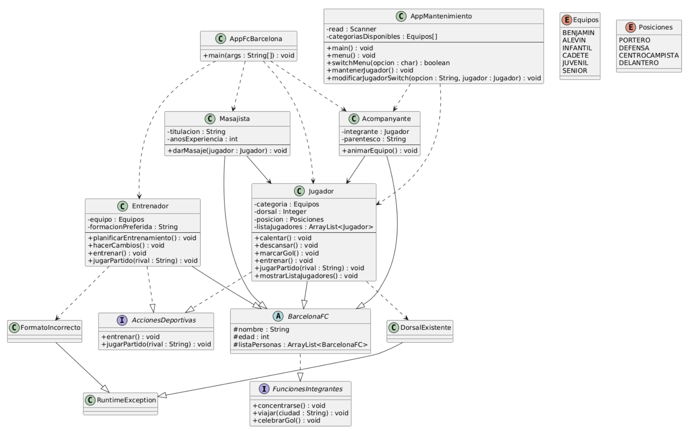

# Práctica 2 - App del FC BARCELONA

## Índice de contenido
1. [Introducción](#introducción)
2. [Estructura de clases](#estructura-de-clases)
3. [Programa principal](#programa-principal)
4. [Video de YouTube](#videodeyoutube)
5. [Entrega](#entrega)

---

### 1. Introducción

La práctica va de realizar una aplicación para gestionar a las personas que hay dentro de un club, en este caso, el FC Barcelona.  La aplicación nos permite crear jugadores, masajistas, acompañantes de los jugadores y entrenadores de equipos. El club cuenta con categorías específicas y los jugadores juegan en posiciones concretas (Ambos son enum).  BarcelonaFC utiliza la interfaz FuncionesIntegradas, que heredan todas sus hijas. Jugador y entrenador utilizan además la interfaz AccionesDeportivas. El sistema debe de validar que el dorsal de los jugadores no se repita entre categorías, y que los entrenadores tengan formaciones con el formato correcto (N-N-N). 


### 2. Estructura de clases
#### Diagrama de clases UML

#### Código de PlantUML
````
@startuml
skinparam classAttributeIconSize 0

' =========================
' INTERFACES
' =========================

interface FuncionesIntegrantes {
    +concentrarse() : void
    +viajar(ciudad : String) : void
    +celebrarGol() : void
}

interface AccionesDeportivas {
    +entrenar() : void
    +jugarPartido(rival : String) : void
}

' =========================
' CLASE ABSTRACTA BASE
' =========================

abstract class BarcelonaFC {
    #nombre : String
    #edad : int
    #listaPersonas : ArrayList<BarcelonaFC>
}

BarcelonaFC ..|> FuncionesIntegrantes

' =========================
' JUGADOR
' =========================

class Jugador {
    -categoria : Equipos
    -dorsal : Integer
    -posicion : Posiciones
    -listaJugadores : ArrayList<Jugador>
    --
    +calentar() : void
    +descansar() : void
    +marcarGol() : void
    +entrenar() : void
    +jugarPartido(rival : String) : void
    +mostrarListaJugadores() : void
}

Jugador --|> BarcelonaFC
Jugador ..|> AccionesDeportivas

' =========================
' ENTRENADOR
' =========================

class Entrenador {
    -equipo : Equipos
    -formacionPreferida : String
    --
    +planificarEntrenamiento() : void
    +hacerCambios() : void
    +entrenar() : void
    +jugarPartido(rival : String) : void
}

Entrenador --|> BarcelonaFC
Entrenador ..|> AccionesDeportivas

' =========================
' MASAJISTA
' =========================

class Masajista {
    -titulacion : String
    -anosExperiencia : int
    --
    +darMasaje(jugador : Jugador) : void
}

Masajista --|> BarcelonaFC
Masajista --> Jugador

' =========================
' ACOMPANYANTE
' =========================

class Acompanyante {
    -integrante : Jugador
    -parentesco : String
    --
    +animarEquipo() : void
}

Acompanyante --|> BarcelonaFC
Acompanyante --> Jugador

' =========================
' EXCEPCIONES
' =========================

class DorsalExistente
class FormatoIncorrecto

DorsalExistente --|> RuntimeException
FormatoIncorrecto --|> RuntimeException

Jugador ..> DorsalExistente
Entrenador ..> FormatoIncorrecto

' =========================
' APPS
' =========================

class AppFcBarcelona {
    +main(args : String[]) : void
}

class AppMantenimiento {
    -read : Scanner
    -categoriasDisponibles : Equipos[]
    --
    +main() : void
    +menu() : void
    +switchMenu(opcion : char) : boolean
    +mantenerJugador() : void
    +modificarJugadorSwitch(opcion : String, jugador : Jugador) : void
}

AppFcBarcelona ..> Jugador
AppFcBarcelona ..> Entrenador
AppFcBarcelona ..> Masajista
AppFcBarcelona ..> Acompanyante

AppMantenimiento ..> Jugador
AppMantenimiento ..> Acompanyante

' =========================
' ENUMS (SIN RELACIONES)
' =========================

enum Equipos {
    BENJAMIN
    ALEVIN
    INFANTIL
    CADETE
    JUVENIL
    SENIOR
}

enum Posiciones {
    PORTERO
    DEFENSA
    CENTROCAMPISTA
    DELANTERO
}

@enduml
```
````
#### Contenido de las clases (java)

- Clase abstracta **BarcelonaFC.java**
> [Link al archivo](https://github.com/daidarzzz/Repositorio1DAM/blob/main/ejercicios_DAM/src/main/java/org/example/TEMA6/Practica2/BarcelonaFC.java)

````
package org.example.TEMA6.Practica2;

import org.example.TEMA5.Persona;

import java.util.ArrayList;

/**
 * Clase madre y abstracta que sirve como "base" para todas
 * las personas del club
 * Implementa la interfaz FuncionesIntegrantes
 *
 */
public abstract class BarcelonaFC implements FuncionesIntegrantes{

    /**
     * Lista estática de personas, aquí se añade a todas las personas creadas
     * permitiendo realizar métodos y consultar ciertas cosas de forma mucho
     * más sencilla
     */
    protected static ArrayList<BarcelonaFC> listaPersonas = new ArrayList<>();
    /**
     * Nombre de la persona
     */
    protected String nombre;
    /**
     * Edad de la persona
     */
    protected int edad;

    /**
     * Constructor básico que recibe como parámetros todos sus atributos y los iguala a
     * los del objeto
     * @param nombre Nombre de la persona
     * @param edad Edad de la persona
     */
    public BarcelonaFC(String nombre, int edad) {
        this.nombre = nombre;
        this.edad = edad;
    }

    /**
     * Método para saber cual es el nombre de la persona
     * @return devuelve su nombre
     */

    public String getNombre() {
        return nombre;
    }

    /**
     * Método para cambiar el nombre de una persona
     * @param nombre el nuevo nombre
     */
    public void setNombre(String nombre) {
        this.nombre = nombre;
    }

    /**
     * Método para saber la edad de una persona
     * @return devuelve la edad
     */
    public int getEdad() {
        return edad;
    }

    /**
     * Método para cambiar la edad de una persona
     * @param edad nueva edad
     */
    public void setEdad(int edad) {
        this.edad = edad;
    }

    /**
     * ToString base
     * @return devuelve sus atributos
     */
    @Override
    public String toString() {
        return "BarcelonaFC{" +
                "nombre='" + nombre + '\'' +
                ", edad=" + edad +
                '}';
    }
}

````

- Clase **Jugador.java**
> [Link al archivo](https://github.com/daidarzzz/Repositorio1DAM/blob/main/ejercicios_DAM/src/main/java/org/example/TEMA6/Practica2/Jugador.java)

````
package org.example.TEMA6.Practica2;

import java.sql.Array;
import java.sql.SQLOutput;
import java.util.ArrayList;

/**
 * Clase que representa a un jugador del barça
 * Hereda de BarcelonaFC
 *
 */
public class Jugador extends BarcelonaFC implements AccionesDeportivas{

    /**
     * Categoría a la que pertenece
     */
    private Equipos categoria;
    /**
     * El dorsal del jugador
     */
    private Integer dorsal;
    /**
     * La posición en la que juega
     */
    private Posiciones posicion;
    /**
     * Lista estática donde se añade a todos los jugadores del club
     */
    protected static ArrayList<Jugador> listaJugadores = new ArrayList<>();

    /**
     * Constructor que crea un jugador, llama a setDorsal para
     * comprobar correctamente que el dorsal esté disponible
     * @param nombre el nombre del jugador
     * @param edad la edad del jugador
     * @param categoria la categoría del jugador
     * @param dorsal el dorsal del jugador
     * @param posicion la posición del jugador
     */
    public Jugador(String nombre, int edad, String categoria, Integer dorsal, String posicion) {
        super(nombre, edad);
        this.categoria = Equipos.valueOf(categoria.toUpperCase());
        this.posicion = Posiciones.valueOf(posicion.toUpperCase());
        setDorsal(dorsal);
    }

    /**
     * Método que sirve para mostrar a todos los jugadores
     */
    public static void mostrarListaJugadores() {
        System.out.println("JUGADORES:");
        int contadorJugadores = 1;
        for (Jugador jugador : listaJugadores) {
            System.out.println("[" + contadorJugadores++ + "]. " + jugador);
        }
    }

    /**
     * Sobrecarga realizaada al método mostrarListaJugadores, sirve para
     * que el método permita filtrar por categoría, mostrando solo los
     * jugadores de la categoría seleccionada
     * @param equipos categoría que quieres ver
     */
    public static void mostrarListaJugadores(Equipos equipos) {
        System.out.println("JUGADORES:");
        int contadorJugadores = 1;
        for (Jugador jugador : listaJugadores) {
            if (jugador.getCategoria().equals(equipos)) System.out.println("[" + contadorJugadores++ + "]. " + jugador);
        }
    }

    /**
     * Método para que el jugador caliente
     */
    public void calentar() {
        System.out.println(nombre + " está calentando...");
    }
    /**
     * Método para que el jugador descanse
     */
    public void descansar() {
        System.out.println(nombre + " va a descansar...");
    }
    /**
     * Método para que el jugador marque gol
     */
    public void marcarGol() {
        System.out.println(nombre.toUpperCase() + " MARCÓ GOOOOOOOOOL");
    }

    /**
     * Método para que el jugador entrene
     */
    @Override
    public void entrenar() {
        System.out.println(nombre + " está entrenando muy duro");
    }
    /**
     * Método para que el jugador juegue el partido contra el rival
     */
    @Override
    public void jugarPartido(String rival) {
        System.out.println(nombre + " va a jugar contra " + rival);
    }

    /**
     * Método para saber en qué categoría juega
     * @return la categoría a la que pertenece
     */
    public Equipos getCategoria() {
        return categoria;
    }

    /**
     * Método para cambiar la categoría en la que juega
     * @param categoria la nueva categoría
     */
    public void setCategoria(Equipos categoria) {
        this.categoria = categoria;
    }

    /**
     * Método para saber cual es el dorsal del jugador
     * @return devuelve el dorsal
     */
    public int getDorsal() {
        return dorsal;
    }

    /**
     * Método que establece el dorsal del jugador
     * Este método comprueba que estás asignando al jugador
     * un dorsal que no está siendo utilizado en la misma categoría.
     * En caso de que esté siendo usado, llamará a la excepción personalizada
     * "DorsalExistente", y no se creará el jugador. En caso contrario,
     *  se aplicará el dorsal correctamente y el jugador será creado
     *  (será añadido a las dos listas que tiene).
     *  Además, este método también sirve para modificar el dorsal de un
     *  jugador que ya tenía un número.
     * @param dorsal el nuevo dorsal a asignar al jugador
     */
    public void setDorsal(Integer dorsal) {
        boolean crearJugador = true;
        try {
            if (listaJugadores.size() == 0) {
                listaJugadores.add(this);
                listaPersonas.add(this);
                crearJugador = false;
            }
            for (Jugador jugador : listaJugadores) {
                if (jugador == this) continue;
                if (jugador.getCategoria() == this.categoria && jugador.getDorsal() == dorsal) {
                    throw new DorsalExistente("Ya hay un jugador de la categoría " + categoria + " con ese dorsal");
                }
            }
            this.dorsal = dorsal;

        } catch (DorsalExistente e) {
            System.out.println(e.getMessage());
            crearJugador = false;
        }
        if (crearJugador && !listaJugadores.contains(this)) {
            listaJugadores.add(this);
            listaPersonas.add(this);
        }

    }

    /**
     * Para saber la posición en la que juega
     * @return devuelve la posición
     */
    public Posiciones getPosicion() {
        return posicion;
    }

    /**
     * Método para cambiar la posición en la que juega
     * @param posicion la nueva posición
     */
    public void setPosicion(Posiciones posicion) {
        this.posicion = posicion;
    }

    /**
     * ToString base
     * @return devuelve los atributos del jugador
     */
    @Override
    public String toString() {
        return "Jugador{" +
                "posicion=" + posicion +
                ", categoria=" + categoria +
                ", dorsal=" + dorsal +
                ", edad=" + edad +
                ", nombre='" + nombre + '\'' +
                '}';
    }

    /**
     * Método para que el jugador se concentre
     */
    @Override
    public void concentrarse() {
        System.out.println("El jugador " + nombre + " está muy concentrado");
    }
    /**
     * Método para que el jugador viaje con su equipo
     */
    @Override
    public void viajar(String ciudad) {
        System.out.println("El jugador " + nombre + " va a viajar con el equipo " + categoria + " a " + ciudad);
    }
    /**
     * Método para que el jugador celebre un golazo
     */
    @Override
    public void celebrarGol() {
        System.out.println(nombre.toUpperCase() + " ESTÁ CELEBRANDO EL GOLAZOOOO DEL EQUIPO");
    }
}
````

- Clase **Entrenador.java**
> [Link al archivo](https://github.com/daidarzzz/Repositorio1DAM/blob/main/ejercicios_DAM/src/main/java/org/example/TEMA6/Practica2/Entrenador.java)

````
package org.example.TEMA6.Practica2;

import java.sql.SQLOutput;

/**
 * Clase que representa a un entrenador del barça
 * Hereda de BarcelonaFC
 */
public class Entrenador extends BarcelonaFC implements AccionesDeportivas{

    /**
     * El equipo que entrena
     */
    private Equipos equipo;
    /**
     * Su formación preferida
     */
    private String formacionPreferida;

    /**
     * Constructor que crea un entrenador y lo añade a la lista de personas
     * También llama a setFormacionPreferida para asegurarnos de que la formación
     * sea correcta
     * @param nombre nombre del entrenador
     * @param edad edad del entrenador
     * @param equipo equipo que dirije
     * @param formacionPreferida su formación preferida
     */
    public Entrenador(String nombre, int edad, String equipo, String formacionPreferida) {
        super(nombre, edad);
        this.equipo = Equipos.valueOf(equipo.toUpperCase());
        setFormacionPreferida(formacionPreferida);
        listaPersonas.add(this);
    }

    /**
     * Método para planificar un entrenamiento
     */
    public void planificarEntrenamiento() {
        System.out.println("El entrenador " + nombre + " está planficando el próximo entrenamiento de su equipo (" + equipo + ")");
    }

    /**
     * Método para realizar cambios
     */
    public void hacerCambios() {
        System.out.println("El entrenador " + nombre + " va a realizar cambios en su equipo (" + equipo + ")");
    }

    /**
     * Método para saber qué equipo dirije
     * @return el equipo que dirije
     */
    public Equipos getEquipo() {
        return equipo;
    }

    /**
     * Método para cambiar el equipo que dirije
     * @param equipo el nuevo equipo que dirige
     */
    public void setEquipo(Equipos equipo) {
        this.equipo = equipo;
    }

    /**
     * Para saber cual es su formación preferida
     * @return Te devuelve su formación preferida
     */
    public String getFormacionPreferida() {
        return formacionPreferida;
    }

    /**
     * Método que coprueba que la formación tenga el formato correcto (N-N-N), en caso
     * contrario, la formación será NULL y saltará la excepción personalizada
     * "FormatoIncorrecto"
     * @param formacionPreferida
     */
    public void setFormacionPreferida(String formacionPreferida) {
        try {
            if (formacionPreferida.matches("\\d-\\d-\\d")) {
                this.formacionPreferida = formacionPreferida;
            } else {
                throw new FormatoIncorrecto("No has introducido el formato correcto (N-N-N)");
            }
        } catch (FormatoIncorrecto e) {
            System.out.println(e.getMessage());
            this.formacionPreferida = null;
        }

    }


    /**
     * El entrenador comienza el entrenamiento
     */
    @Override
    public void entrenar() {
        System.out.println(nombre + " esta entrenando a su equipo " + equipo);
    }

    /**
     * Empieza a dirigir el partido de su equipo
     * @param rival el rival contra el que juega
     */
    @Override
    public void jugarPartido(String rival) {
        System.out.println("El equipo de " + nombre + " (" + equipo + ") va a jugar contra " + rival);
    }

    /**
     * El entrenador se concentra
     */
    @Override
    public void concentrarse() {
        System.out.println("El entrenador " + nombre +  " está muy concentrado en el próximo partido");
    }

    /**
     * Método para viajar con su equipo
     * @param ciudad ciudad a la que van
     */
    @Override
    public void viajar(String ciudad) {
        System.out.println(nombre + " va a viajar con su equipo a " + ciudad);
    }

    /**
     * Celebra el golazo de su equipo
     */
    @Override
    public void celebrarGol() {
        System.out.println("EL ENTRENADOR " + nombre.toUpperCase() + " CELEBRA EL GOLAZO DE SU EQUIPO");
    }

    /**
     * toString base
     * @return devuelve los atributos del entrenador
     */
    @Override
    public String toString() {
        return "Entrenador{" +
                "equipo=" + equipo +
                ", formacionPreferida='" + formacionPreferida + '\'' +
                ", edad=" + edad +
                ", nombre='" + nombre + '\'' +
                '}';
    }
}
````

- Clase **Acompanyante.java**
> [Link al archivo](https://github.com/daidarzzz/Repositorio1DAM/blob/main/ejercicios_DAM/src/main/java/org/example/TEMA6/Practica2/Acompanyante.java)

````
package org.example.TEMA6.Practica2;

/**
 *
 * Clase acompañante que hereda de BarcelonaFC y cuenta con métodos y atributos propios.
 *
 */
public class Acompanyante extends BarcelonaFC{

    /**
     * Jugador que acompaña
     */
    private Jugador integrante;
    /**
     * Parentesco con el jugador
     */
    private String parentesco;

    /**
     *Constructor que crea un acompañante y después lo añade a la lista de personas
     * @param nombre nombre del acompañante
     * @param edad su edad
     * @param integrante el integrante que acompaña
     * @param parentesco su parentesco con el integrante
     */
    public Acompanyante(String nombre, int edad, Jugador integrante, String parentesco) {
        super(nombre, edad);
        this.integrante = integrante;
        this.parentesco = parentesco;
        listaPersonas.add(this);
    }

    /**
     * Con este método anima al equipo del jugador que acompaña
     */
    public void animarEquipo() {
        System.out.println("¡¡¡ANIMANDO AL EQUIPO DE " + integrante.nombre + "!!!");
    }

    /**
     * Get del integrante
     * @return devuelve el integrante
     */
    public Jugador getIntegrante() {
        return integrante;
    }

    /**
     * set del integrante, sirve para cambiar al integrante al que acompaña
     * @param integrante el integrante que vas a añadirle
     */
    public void setIntegrante(Jugador integrante) {
        this.integrante = integrante;
    }

    /**
     * Método set para devolver el parentesco
     * @return Devuelve su parentesco
     */
    public String getParentesco() {
        return parentesco;
    }

    /**
     * Cambiar el parentesco con su acompañante
     * @param parentesco el nuevo parentesco
     */
    public void setParentesco(String parentesco) {
        this.parentesco = parentesco;
    }

    /**
     * ToString base
     * @return devuelve los datos del acompañante
     */
    @Override
    public String toString() {
        return "Acompanyante{" +
                "integrante=" + integrante +
                ", parentesco='" + parentesco + '\'' +
                ", nombre='" + nombre + '\'' +
                ", edad=" + edad +
                '}';
    }

    /**
     * El acompañante se concentra
     */
    @Override
    public void concentrarse() {
        System.out.println("El acompañante " + nombre + " se está concentrando para apoyar a su integrante (" + integrante.nombre + ")");
    }

    /**
     * Acompañante viaja a la ciudad a la que va el equipo
     * @param ciudad ciudad a la que viaja
     */
    @Override
    public void viajar(String ciudad) {
        System.out.println("El acompañante " + nombre + " va a viajar");
    }

    /**
     * Celebra el gol del equipo
     */
    @Override
    public void celebrarGol() {
        System.out.println("EL ACOMPAÑANTE " + nombre.toUpperCase() + " CELEBRA EL GOLAAAZOOOOO");
    }
}
````

- Clase **Masajista.java**
> [Link al archivo](https://github.com/daidarzzz/Repositorio1DAM/blob/main/ejercicios_DAM/src/main/java/org/example/TEMA6/Practica2/Masajista.java)

````
package org.example.TEMA6.Practica2;

/**
 * Clase que representa a un masajista del barça
 * Hereda de BarcelonaFC e implementa su interfaz
 */
public class Masajista extends BarcelonaFC {

    /**
     * La titulación que tiene el masajista
     */
    private String titulacion;
    /**
     * Los años de experiencia
     */
    private int anosExperiencia;

    /**
     * Constructor que crea un masajista y lo añade a la lista de personas
     *
     * @param nombre Nombre del masajista
     * @param edad su edad
     * @param titulacion la titulación del masajista
     * @param anosExperiencia sus años de experiencia
     */
    public Masajista(String nombre, int edad, String titulacion, int anosExperiencia) {
        super(nombre, edad);
        this.titulacion = titulacion;
        this.anosExperiencia = anosExperiencia;
        listaPersonas.add(this);
    }


    /**
     * Dar masaje a un jugador en concreto
     * @param jugador el jugador que recibe el masaje
     */
    public void darMasaje(Jugador jugador) {
        System.out.println( nombre +" está dándole un masaje a " + jugador.nombre);
    }

    /**
     * Método para saber la titulación del masajista
     * @return devuelve la titulación
     */
    public String getTitulacion() {
        return titulacion;
    }

    /**
     * Cambia de titulación
     * @param titulacion la nueva titulación
     */
    public void setTitulacion(String titulacion) {
        this.titulacion = titulacion;
    }

    /**
     * Método para saber cuantos años de experiencia tiene
     * @return devuelve sus años de experiencia
     */
    public int getAnosExperiencia() {
        return anosExperiencia;
    }

    /**
     * Método para cambiar sus años de experiencia
     * @param anosExperiencia los años de experiencia actuales
     */
    public void setAnosExperiencia(int anosExperiencia) {
        this.anosExperiencia = anosExperiencia;
    }
    /**
     * ToString base
     * @return devuelve los datos del masajista
     */
    @Override
    public String toString() {
        return "Masajista{" +
                "anosExperiencia=" + anosExperiencia +
                ", titulacion='" + titulacion + '\'' +
                ", edad=" + edad +
                ", nombre='" + nombre + '\'' +
                '}';
    }

    /**
     * Masajista concentrandose en el masaje
     */
    @Override
    public void concentrarse() {
        System.out.println("El masajista " + nombre + " está muy concentrado en el masaje");
    }

    /**
     * Masajista viajando con el equipo
     * @param ciudad ciudad a la que viajan
     */
    @Override
    public void viajar(String ciudad) {
        System.out.println("El masajista " + nombre + " va a viajar con el equipo a " + ciudad);
    }

    /**
     * Masajista celebrando un GOLAZO
     */
    @Override
    public void celebrarGol() {
        System.out.println("EL MASAJISTA " +nombre.toUpperCase() + " CELEBRA EL GOLAZO DE SU EQUIPOOO");
    }
}
````

- Clase **AppMantenimiento.java**
> [Link al archivo](https://github.com/daidarzzz/Repositorio1DAM/blob/main/ejercicios_DAM/src/main/java/org/example/TEMA6/Practica2/AppMantenimiento.java)

````
package org.example.TEMA6.Practica2;

import java.util.Scanner;

public class AppMantenimiento {
    static Scanner read = new Scanner(System.in);
    static Equipos[] categoriasDisponibles = Equipos.values();
    static void main() {
        boolean seguir = true;
        do {
            menu();
            System.out.print("Selecciona una opción --> ");
            char opcion = read.next().charAt(0);
            seguir = switchMenu(opcion);
        } while (seguir);

    }

    public static void menu() {
        System.out.println("=== APP DE MANTENIMIENTO DEL FC BARCELONA ===");
        System.out.println();
        System.out.println("[1]. Mantenimiento de jugadores");
        System.out.println("[2]. Consultar equipos");
        System.out.println("[X]. Salir");
        System.out.println();
        System.out.println("=============================================");
        System.out.println();
    }

    public static boolean switchMenu(char opcion) {

        switch (opcion) {
            case '1':
                mantenerJugador();
                break;
            case '2':
                for (int i = 0; i < categoriasDisponibles.length; i++) {
                    System.out.println((i+1) + ". " + categoriasDisponibles[i]);
                }
                System.out.print("Escribe la categoría que quieres ver: ");
                Equipos equipo = Equipos.valueOf(read.next().toUpperCase());
                System.out.println("Lista de jugadores de la categoría " + equipo);
                for (Jugador jugador : Jugador.listaJugadores) {
                    if (jugador.getCategoria() == equipo) {
                        System.out.println("- " + jugador);
                    }
                }
                break;
            case 'X':
            case 'x':
                System.out.println("ADIOS!!!");
                return false;
            default:
                System.out.println("Opción no contemplada");
                break;
        }
        return true;

    }


    public static void mantenerJugador() {
        System.out.println(" === MANTENIMIENTO DE JUGADORES ===");
        System.out.println();
        System.out.println("[1]. Añadir nuevo jugador");
        System.out.println("[2]. Modificar datos de jugador");
        System.out.println("[3]. Crear acompañantes (sólo seniors)");
        System.out.println("[X]. Volver al menú principal");

        System.out.println();
        System.out.print("Selecciona una opción --> ");
        char opcion = read.next().charAt(0);

        switch (opcion) {
            case '1':
                System.out.println(" === MANTENIMIENTO DE JUGADORES (Añadir nuevo jugador) ===");
                System.out.println();
                System.out.println("Introduce los siguientes datos con el mismo formato indicado [nombre,edad,categoria,dorsal,posicion]: ");
                String[] datosJugador = read.next().split(",");
                Jugador nuevo = new Jugador(datosJugador[0], Integer.parseInt(datosJugador[1]), datosJugador[2], Integer.parseInt(datosJugador[3]), datosJugador[4]);
                if (Jugador.listaJugadores.contains(nuevo)) System.out.println("Jugador creado con éxito!!!");
                break;
            case '2':
                System.out.println(" === MANTENIMIENTO DE JUGADORES (Modificar datos de jugador existente) ===");
                System.out.println();
                System.out.println("¿De qué jugador quieres hacer cambios?");
                Jugador.mostrarListaJugadores();
                System.out.println("====================================");
                System.out.print("Selecciona una opción --> ");
                int escogido = read.nextInt()-1;
                Jugador jugador = Jugador.listaJugadores.get(escogido);
                System.out.println("Modificando jugador: " + jugador);
                System.out.println("¿Qué quieres modificar? [nombre,edad,categoria,dorsal,posicion]:");
                System.out.println("====================================");
                System.out.print("Selecciona una opción --> ");
                String opcionModificar = read.next();
                System.out.println("====================================");
                modificarJugadorSwitch(opcionModificar, jugador);

                break;
            case '3':
                System.out.println(" === MANTENIMIENTO DE JUGADORES (Crear Acompañante (Sólo senior) ===");
                boolean haySeniors = false;
                for (BarcelonaFC senior : BarcelonaFC.listaPersonas) {
                    if (senior instanceof Jugador) {
                        if (((Jugador) senior).getCategoria().equals(Equipos.SENIOR)) {
                            haySeniors = true;
                            break;
                        }
                    }
                }
                if (haySeniors) {
                    System.out.print("Introduce el nombre del acompañante: ");
                    String nombre = read.next();
                    System.out.print("Introduce su edad: ");
                    int edad = read.nextInt();
                    System.out.println("Selecciona el jugador al que quiera acompañar:");
                    Jugador.mostrarListaJugadores(Equipos.SENIOR);
                    System.out.print("Selecciona una opción --> ");
                    int opcionJugador = read.nextInt() -1;
                    read.nextLine();
                    System.out.print("Introduce el parentesco: ");
                    String parentesco = read.nextLine();
                    Acompanyante acompanyante = new Acompanyante(nombre, edad, Jugador.listaJugadores.get(opcionJugador), parentesco);
                    System.out.println("Acompañante creado con éxito!!!");
                } else {
                    System.out.println("No puedes crear un acompañante porque no hay ningún senior en el club.");
                }

                break;
            case 'x':
            case 'X':
                System.out.println("ADIOS!!!");
                return;
        }
    }

    public static void modificarJugadorSwitch(String opcion, Jugador jugador) {

        switch (opcion.toLowerCase()) {
            case "nombre":
                System.out.print("Nuevo nombre -->");
                String nombre = read.next();
                jugador.setNombre(nombre);
                System.out.println("Nombre cambiado con éxito!!!");
                break;
            case "dorsal":
                System.out.print("Nuevo dorsal -->");
                int dorsal = read.nextInt();
                int dorsalAntiguo = jugador.getDorsal();
                jugador.setDorsal(dorsal);
                if (dorsalAntiguo != jugador.getDorsal()) System.out.println("Dorsal cambiado con éxito!!!");
                break;
            case "edad":
                System.out.print("Nueva edad -->");
                int edad = read.nextInt();
                jugador.setEdad(edad);
                System.out.println("Edad cambiada con éxito!!!");
                break;
            case "categoria":
                System.out.print("Nueva categoría -->");
                String categoria = read.next();
                try {
                    jugador.setCategoria(Equipos.valueOf(categoria));
                } catch (IllegalArgumentException e) {
                    System.out.println("Has introducido un equipo no contemplado");
                    break;
                }
                System.out.println("Categoría cambiada con éxito!!!");
                break;
            case "posicion":
                System.out.print("Nueva posición -->");
                String posicion = read.next();
                try {
                    jugador.setCategoria(Equipos.valueOf(posicion));
                } catch (IllegalArgumentException e) {
                    System.out.println("Has introducido una posición no contemplada");
                    break;
                }
                System.out.println("Posición cambiada con éxito!!!");
                break;
        }

    }


}
````

- Interfaz **AccionesDeportivas.java**
> [Link al archivo](https://github.com/daidarzzz/Repositorio1DAM/blob/main/ejercicios_DAM/src/main/java/org/example/TEMA6/Practica2/AccionesDeportivas.java)

````
package org.example.TEMA6.Practica2;

/**
 *
 * Interfaz que implementa dos métodos (Entrenar y jugar partido)
 *
 */
public interface AccionesDeportivas {

    void entrenar();
    void jugarPartido(String rival);

}
````

- Interfaz **FuncionesIntegrantes.java**
> [Link al archivo](https://github.com/daidarzzz/Repositorio1DAM/blob/main/ejercicios_DAM/src/main/java/org/example/TEMA6/Practica2/FuncionesIntegrantes.java)

````
package org.example.TEMA6.Practica2;

/**
 *
 * Interfaz que implementa dos métodos (Entrenar y jugar partido)
 *
 */
public interface AccionesDeportivas {

    void entrenar();
    void jugarPartido(String rival);

}
````

- Enum **Equipos.java**
> [Link al archivo](https://github.com/daidarzzz/Repositorio1DAM/blob/main/ejercicios_DAM/src/main/java/org/example/TEMA6/Practica2/Equipos.java)

````
package org.example.TEMA6.Practica2;

/**
 * Enum de las categorías disponibles
 */
public enum Equipos {

    BENJAMIN, ALEVIN, INFANTIL, CADETE, JUVENIL, SENIOR;

}

````

- Enum **Posiciones.java**
> [Link al archivo](https://github.com/daidarzzz/Repositorio1DAM/blob/main/ejercicios_DAM/src/main/java/org/example/TEMA6/Practica2/Posiciones.java)

````
package org.example.TEMA6.Practica2;

/**
 * Enum de las posiciones disponibles
 */
public enum Posiciones {

    PORTERO, DEFENSA, CENTROCAMPISTA, DELANTERO;

}
````

- Excepcion **DorsalExistente.java**
> [Link al archivo](https://github.com/daidarzzz/Repositorio1DAM/blob/main/ejercicios_DAM/src/main/java/org/example/TEMA6/Practica2/DorsalExistente.java)

````
package org.example.TEMA6.Practica2;

/**
 * Excepción que salta cuando eliges un dorsal que ya estaba asignado a otro jugador
 * de la misma categoría
 */
public class DorsalExistente extends RuntimeException {
    public DorsalExistente(String message) {
        super(message);
    }
}
````

- Excepcion **FormatoIncorrecto.java**
> [Link al archivo](https://github.com/daidarzzz/Repositorio1DAM/blob/main/ejercicios_DAM/src/main/java/org/example/TEMA6/Practica2/FormatoIncorrecto.java)

````
package org.example.TEMA6.Practica2;

/**
 * Excepción que salta en caso de que el formato de la formación del entrenador sea incorrecta
 */
public class FormatoIncorrecto extends RuntimeException {
    public FormatoIncorrecto(String message) {
        super(message);
    }
}
````

### 3. Programa principal

- Clase **AppFcBarcelona.java**
> [Link al archivo](https://github.com/daidarzzz/Repositorio1DAM/blob/main/ejercicios_DAM/src/main/java/org/example/TEMA6/Practica2/AppFcBarcelona.java)

````
package org.example.TEMA6.Practica2;

import org.example.TEMA5.Persona;

public class AppFcBarcelona {
    static void main(String[] args) {

        System.out.println();
        System.out.println();
        Jugador joa = new Jugador("Joaquín", 18, "juvenil", 24, "delantero");

        System.out.println(joa);

        Jugador jacobo = new Jugador("Jacobo", 82, "juvenil", 23, "portero");
        System.out.println(jacobo);

        Entrenador carlos = new Entrenador("Carlos", 22, "JUVENIL", "3-5-2");
        System.out.println(carlos);
        Entrenador manuel = new Entrenador("Manuel", 18, "senior", "4-3-3-1");
        System.out.println(manuel);
        Acompanyante david = new Acompanyante("David", 12, jacobo, "bisabuelo");
        System.out.println(david);
        Masajista pepe = new Masajista("Pepe", 44, "Grado en masajista", 20);
        System.out.println(pepe);
        Masajista juan = new Masajista("juan", 45, "Grado en dinero", 39);
        System.out.println(juan);

        System.out.println("=== JUGADORES ACTUALES ===");
        Jugador.mostrarListaJugadores();
        System.out.println();

        System.out.println("=== Equipo concentrandose ===");
        for (BarcelonaFC persona : BarcelonaFC.listaPersonas) {
            persona.concentrarse();
        }
        System.out.println();
        System.out.println("=== Equipo entrenando ===");
        for (BarcelonaFC persona : BarcelonaFC.listaPersonas) {
            if (persona instanceof AccionesDeportivas) {
                ((AccionesDeportivas) persona).entrenar();
            }
        }
        System.out.println();
        pepe.darMasaje(jacobo);
        System.out.println();
        System.out.println("=== Equipo viajando a Madrid ===");
        for (BarcelonaFC persona : BarcelonaFC.listaPersonas) {
            if (persona instanceof AccionesDeportivas) {
                persona.viajar("Madrid");
            }
        }
        System.out.println();
        System.out.println("=== Entrenadores van a planificar el entrenamiento ===");
        for (BarcelonaFC persona : BarcelonaFC.listaPersonas) {
            if (persona instanceof Entrenador) {
                ((Entrenador) persona).planificarEntrenamiento();
            }
        }
        System.out.println();
        System.out.println("=== Equipo entrenando ===");
        for (BarcelonaFC persona : BarcelonaFC.listaPersonas) {
            if (persona instanceof AccionesDeportivas) {
                ((AccionesDeportivas) persona).entrenar();
            }
        }
        System.out.println();
        System.out.println("=== Equipo descansando ===");
        for (BarcelonaFC persona : BarcelonaFC.listaPersonas) {
            if (persona instanceof Jugador) {
                ((Jugador) persona).descansar();
            }
        }
        System.out.println();
        System.out.println("=== Equipo descansando ===");
        for (BarcelonaFC persona : BarcelonaFC.listaPersonas) {
            if (persona instanceof Jugador) {
                ((Jugador) persona).descansar();
            }
        }
        System.out.println();
        System.out.println("=== Equipo calentando ===");
        for (BarcelonaFC persona : BarcelonaFC.listaPersonas) {
            if (persona instanceof Jugador) {
                ((Jugador) persona).calentar();
            }
        }
        System.out.println();
        System.out.println("=== Equipo va a jugar el partido ===");
        for (BarcelonaFC persona : BarcelonaFC.listaPersonas) {
            if (persona instanceof AccionesDeportivas) {
                ((AccionesDeportivas) persona).jugarPartido("Real Madrid");
            }
        }
        System.out.println();
        System.out.println("=== Acompañantes animando a sus equipos ===");
        for (BarcelonaFC persona : BarcelonaFC.listaPersonas) {
            if (persona instanceof Acompanyante) {
                ((Acompanyante) persona).animarEquipo();
            }
        }

        System.out.println();
        System.out.println("=== Entrenadores van a realizar cambios ===");
        for (BarcelonaFC persona : BarcelonaFC.listaPersonas) {
            if (persona instanceof Entrenador) {
                ((Entrenador) persona).hacerCambios();
            }
        }
        System.out.println();
        System.out.println("=== Jugadores metiendo golazos ===");
        for (BarcelonaFC persona : BarcelonaFC.listaPersonas) {
            if (persona instanceof Jugador) {
                ((Jugador) persona).marcarGol();
            }
        }
        System.out.println();
        System.out.println("=== Equipos celebrando golazos ===");
        for (BarcelonaFC persona : BarcelonaFC.listaPersonas) {
            persona.celebrarGol();
        }
        System.out.println();
        System.out.println("=== Realizando masajes a jugadores con masajista "+ pepe.nombre + " ===");
        for (Jugador jugador : Jugador.listaJugadores) {

            pepe.darMasaje(jugador);

        }
        System.out.println();
        System.out.println("=== Equipo viaja a Barcelona de vuelta ===");
        for (BarcelonaFC persona : BarcelonaFC.listaPersonas) {
            persona.viajar("Barcelona");
        }
        System.out.println();
        System.out.println("=== Equipo viaja a Barcelona de vuelta ===");
        for (BarcelonaFC persona : BarcelonaFC.listaPersonas) {
            persona.viajar("Barcelona");
        }
        System.out.println();
        System.out.println("=== Equipo descansando ===");
        for (BarcelonaFC persona : BarcelonaFC.listaPersonas) {
            if (persona instanceof Jugador) {
                ((Jugador) persona).descansar();
            }
        }
        System.out.println();
        System.out.println();
        AppMantenimiento.main();


    }
}
````

### 4. Video de YouTube

> [Link al video](https://www.youtube.com/watch?v=0G2SIljYCa4)


### 5. Entrega
- [X] Código fuente en GitHub: [link](../practica2/)
- [X] Documentación
- [X] Pruebas (Video de YT)
